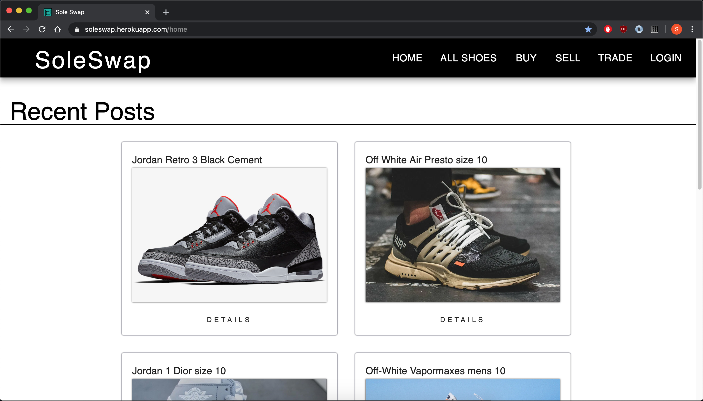
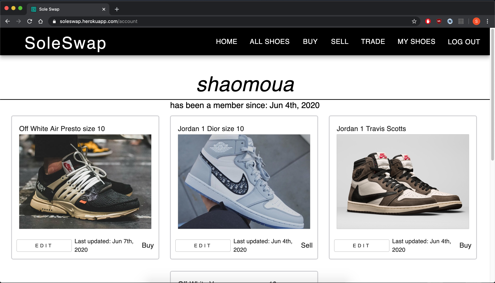
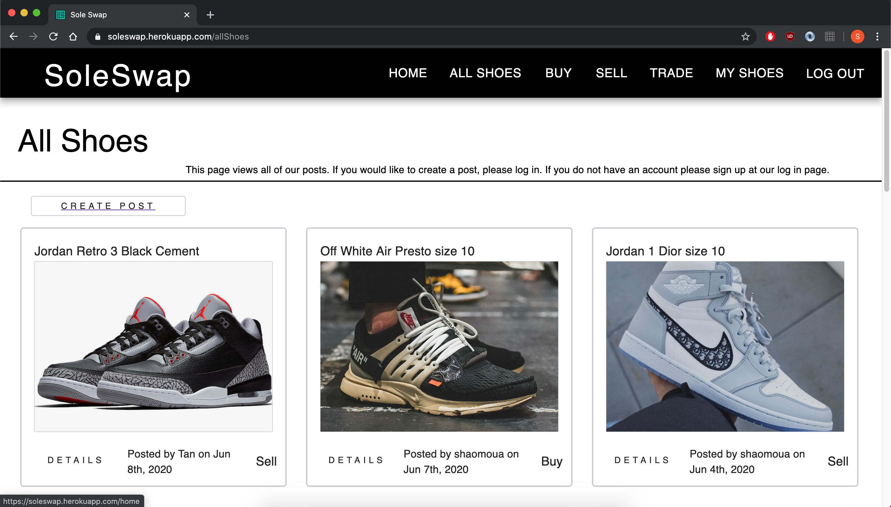
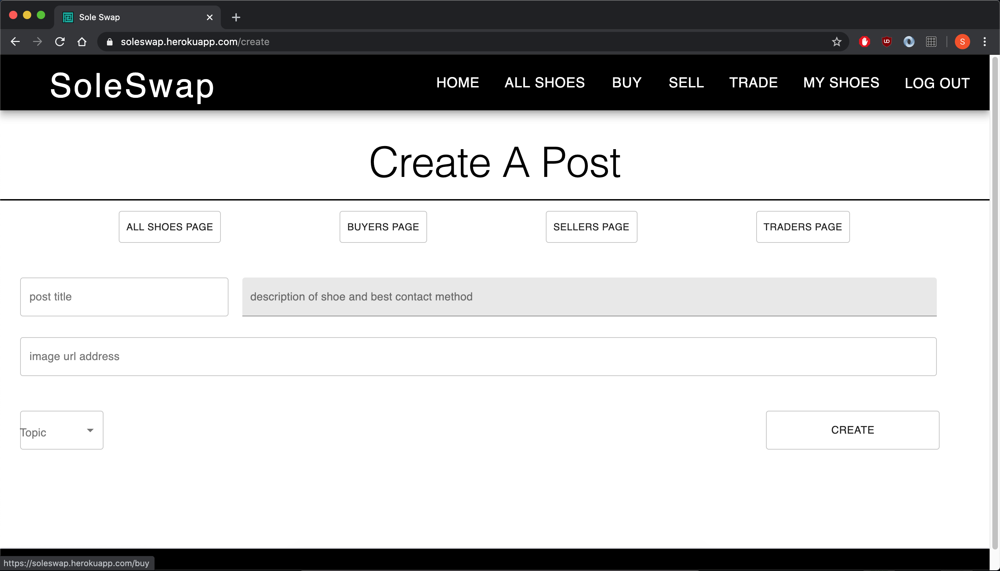
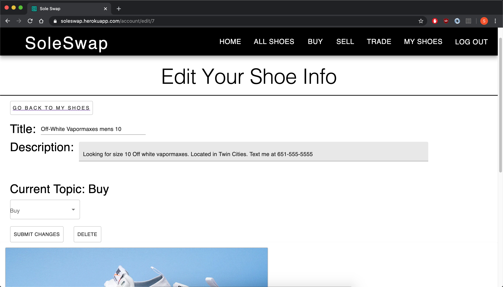

# SOLE SWAP

## Description

Duration: 2 weeks

Soleswap is a web application that allows users to connect and create posts whether they are looking to buy, sell or trade their shoes. In the shoe world it's about collecting and re-selling shoes. Certain shoes are released in limited amounts giving them high value. There are many 3rd party applications that do transactions but have issues with whether the shoes are authentic or not. With Soleswap, the users can contact each other in their own means which means the trust can be built from one person to another.

To see a demo of Soleswap please visit [https://soleswap.herokuapp.com/home](https://soleswap.herokuapp.com/home)

## Screen Shots of Soleswap
Here are some screen shots of Soleswap.

**Landing Page:**


**Account Page:** 


**All Shoes Page:**


**Create Page:**


**Edit Page:**


## Prerequisites

Software required to install this application are as listed:

* Node.js

* PostgreSQL

* Nodemon

## Installation

1.) Create a database named ```shoe_web``` and run these queries,
```
CREATE TABLE "user" (
	"id" SERIAL PRIMARY KEY,
	"username" varchar(100),
	"password" varchar(255),
	"user_email" varchar(255),
	"user_img" varchar(1000),
	"user_location" varchar(255),
	"user_date" DATE DEFAULT CURRENT_DATE
);


CREATE TABLE "category" (
	"cat_id" SERIAL PRIMARY KEY NOT NULL,
	"cat_name" varchar(25) NOT NULL,
	"cat_description" varchar(255) NOT NULL
);

CREATE TABLE "post" (
	"post_id" SERIAL PRIMARY KEY NOT NULL,
	"post_name" varchar(100) NOT NULL,
	"post_body" varchar(5000) NOT NULL,
	"post_image" varchar(1000) NOT NULL,
	"post_date" DATE NOT NULL DEFAULT CURRENT_DATE,
	"post_cat" integer NOT NULL,
	"user_id" integer NOT NULL,
	FOREIGN KEY (user_id) REFERENCES "user"(id),
	FOREIGN KEY (post_cat) REFERENCES "category"(cat_id)
);

INSERT INTO "category" ('cat_name', 'cat_description')
VALUES ('Buy', 'Buyers Category'), ('Sell', 'Sellers Category'), ('Trade', 'Traders Category');
```
2.) Open your source code editor and run ```npm install```

3.) Run ```npm run server``` in your terminal

4.) Run ```npm run client``` in your terminal which will open up a new browser tab to view the application

## Usage

To use this web application feel free to follow these steps.

1.) Click on ```Login``` on the top right of the page.

2.) Click on the ```Sign Up``` option at the bottom of the page.

3.) Enter your information and ```Sign Up```. This will take you to your account page.

4.) Browse topics using the navigation bar at the top of the page.

5.) Create a post from the topic pages by clicking ```Create Post``` and filling in the required inputs.

6.) ```Edit``` your posts as needed from your account page once a post has been made.

## Technologies

* React.js

* Redux.js

* Redux-Saga

* Express.js

* Node.js

* moment.js

* sweetalert2

* Material-UI

* Heroku

## Acknowledgement

Thanks to Prime Digital Academy for their amazing instructors who helped guide me on my journey. Those including Dane, Dev, and Chris Black were a huge help and my wonderful cohort Lamport for their support and excellent minds. Without these people, I wouldn't be able to come as far as I have now.


