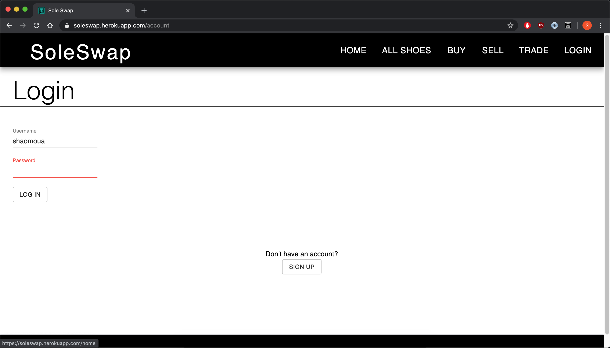
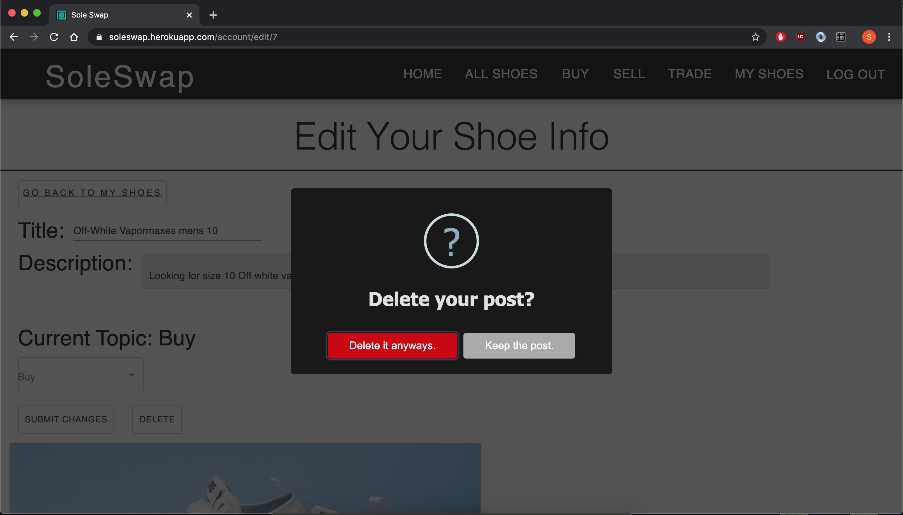

# SOLE SWAP

## Description

Duration: 2 weeks

Soleswap is a web application that allows users to connect and create posts whether they are looking to buy, sell or trade their shoes. In the shoe world it's about collecting and re-selling shoes. Certain shoes are released in limited amounts giving them high value. There are many 3rd party applications that do transactions but have issues with whether the shoes are authentic or not. With Soleswap, the users can contact each other in their own means which means the trust can be built from one person to another.

To see a demo of Soleswap please visit [https://soleswap.herokuapp.com/home](https://soleswap.herokuapp.com/home)

## Screen Shots of Soleswap
Here are some screen shots of Soleswap.

Landing Page: 


Login Screen:


Account Page: 


All Shoes Page:


Create Page:


Edit Page:


Delete Option:


## Prerequisites

Software required to install this application are as listed:

⋅⋅* Node.js
⋅⋅* PostgreSQL
⋅⋅* Nodemon

## Installation

1.) Create a database named shoe_web and enter these queries.
```
CREATE TABLE "user" (
	"id" SERIAL PRIMARY KEY,
	"username" varchar(100),
	"password" varchar(255),
	"user_email" varchar(255),
	"user_img" varchar(1000),
	"user_location" varchar(255),
	"user_date" DATE DEFAULT CURRENT_DATE
);


CREATE TABLE "category" (
	"cat_id" SERIAL PRIMARY KEY NOT NULL,
	"cat_name" varchar(25) NOT NULL,
	"cat_description" varchar(255) NOT NULL
);

CREATE TABLE "post" (
	"post_id" SERIAL PRIMARY KEY NOT NULL,
	"post_name" varchar(100) NOT NULL,
	"post_body" varchar(5000) NOT NULL,
	"post_image" varchar(1000) NOT NULL,
	"post_date" DATE NOT NULL DEFAULT CURRENT_DATE,
	"post_cat" integer NOT NULL,
	"user_id" integer NOT NULL,
	FOREIGN KEY (user_id) REFERENCES "user"(id),
	FOREIGN KEY (post_cat) REFERENCES "category"(cat_id)
);

INSERT INTO "category" ('cat_name', 'cat_description')
VALUES ('Buy', 'Buyers Category'), ('Sell', 'Sellers Category'), ('Trade', 'Traders Category');
```


